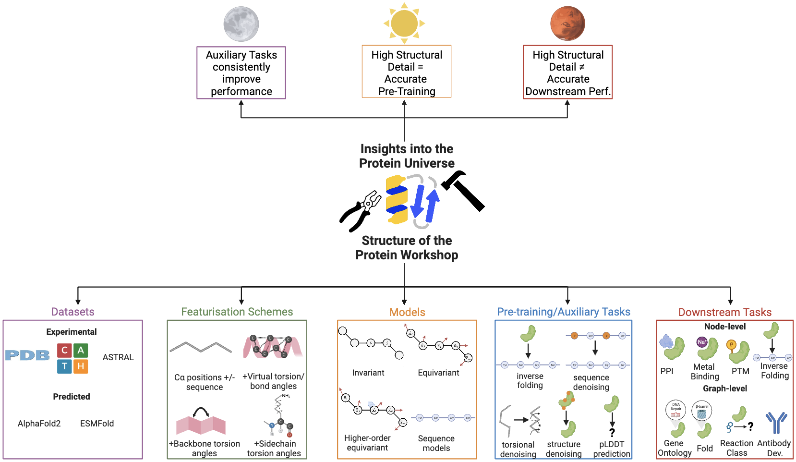

.. Protein Workshop documentation master file, created by
   sphinx-quickstart on Tue Mar 28 23:19:07 2023.
   You can adapt this file completely to your liking, but it should at least
   contain the root `toctree` directive.

Welcome to Protein Workshop's documentation!
============================================

.. mdinclude:: ../../README.md
    :start-line: 1
    :end-line: 10

.. mdinclude:: ../../README.md
    :start-line: 14
    :end-line: 22

.. toctree::
   :maxdepth: 2
   :caption: Contents:

   installation
   tutorials
   overview
   quickstart

.. toctree::
   :glob:
   :maxdepth: 2
   :hidden:
   :caption: Default Configs

   configs/templates
   configs/dataset
   configs/model
   configs/task
   configs/features
   configs/transforms
   configs/metrics
   framework
   ml_components

.. toctree::
   :glob:
   :maxdepth: 1
   :hidden:
   :caption: API Reference

   modules/proteinworkshop.train
   modules/proteinworkshop.datasets
   modules/proteinworkshop.models
   modules/proteinworkshop.tasks
   modules/proteinworkshop.features
   modules/proteinworkshop.utils
   modules/proteinworkshop.constants
   modules/proteinworkshop.types
   modules/proteinworkshop.metrics

Indices and tables
==================

* :ref:`genindex`
* :ref:`modindex`
* :ref:`search`
